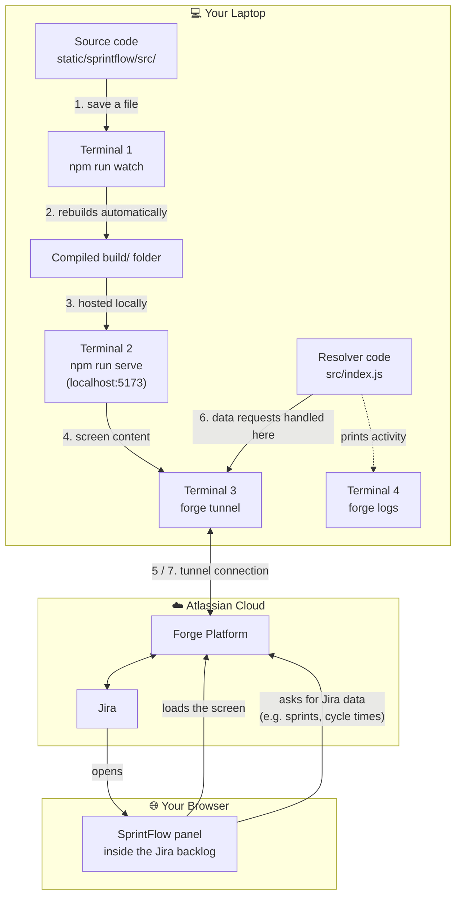
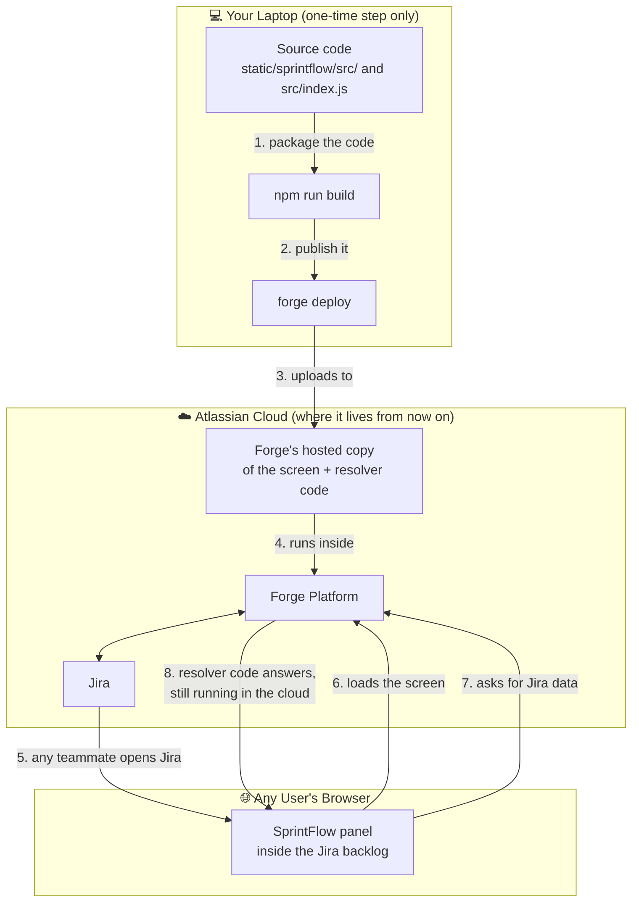

# SprintFlow on Atlassian Forge: What It Is & How We Ship Changes

## 1. What is Atlassian Forge?

Forge is Atlassian's official platform for building custom apps that live *inside* Jira, Confluence, and other Atlassian products. Instead of standing up our own website and servers, we write code that Atlassian hosts, secures, and runs for us on their cloud.

Think of it like this: a normal website needs its own building (servers), its own security guards, and its own address (domain/hosting). A Forge app instead gets a "room" built directly inside Jira's existing building — it shows up right where users already are, uses Jira's existing login and security, and Atlassian is responsible for keeping the lights on.

### Why we use Forge for SprintFlow

- **No servers to manage.** Atlassian runs and scales the app for us — we never patch an OS, renew a certificate, or provision a machine.
- **Native integration.** SprintFlow appears as an action directly inside the Jira backlog, with direct access to the board, sprint, and issue data it needs — no separate login or data export/import step.
- **Built-in security model.** Forge apps declare exactly what Jira data they're allowed to touch (see "Permissions" below), and Atlassian enforces those boundaries.
- **One codebase, every site.** The same app can be installed on any Jira Cloud site (e.g., our staging site today, production later) without rewriting it.

### What SprintFlow specifically uses Forge for

| Forge piece | Plain-English role |
|---|---|
| **Custom UI panel** | The actual SprintFlow screen users see and click around in — built with the same web technology (React) as any modern website, just displayed inside a Jira panel. |
| **Resolver functions** | The "backend brain." When the SprintFlow screen needs data — sprints, board statuses, team members, historical cycle times — it asks a resolver function to go fetch that from Jira on its behalf. |
| **Storage** | A small filing cabinet Atlassian gives each app to save settings (e.g., which statuses count as "Dev" vs. "QA", saved cycle time overrides) so they persist between visits. |

---

## 2. Key Terms (Glossary)

| Term | What it means |
|---|---|
| **App** | The SprintFlow plugin as a whole — the bundle of frontend screens + backend resolver code. |
| **Deploy** | Publishing a new version of our code to Atlassian's servers. This does *not* automatically mean every site is using it — see the gotcha in Section 5. |
| **Install** | Connecting the app to a specific Jira site (e.g., our Kroger Stage site) so people there can actually use it. Only needs to happen once per site; after that, deploys update it automatically. |
| **Environment** | Forge separates work into `development`, `staging`, and `production` buckets, so changes can be tested before they reach real users. Deploying to an environment (`forge deploy -e <environment>`) only uploads code to that bucket in Atlassian's registry — it has **no effect on any site** unless that site has separately been installed against that environment (see the Environments table in Section 5). |
| **Tunnel** | A temporary, personal preview mode. It lets a developer see their in-progress changes live inside Jira *before* deploying them for everyone else. |
| **Resolver** | A named backend function (e.g., "get me the list of sprints") that the SprintFlow screen calls when it needs Jira data. |
| **Manifest** | A configuration file (`manifest.yml`) that lists everything the app is allowed to do — which screens it shows, which resolver functions exist, and which Jira data permissions it needs. |

---

## 3. Making and Testing a Change (Local Development)

This section is for whoever is actively writing code changes. It walks through previewing a change privately before anyone else sees it.

### How the pieces connect

The diagram below traces one full loop: a code edit on the developer's laptop, through the local terminals, into the Atlassian cloud, and out to what a user sees in their browser.



**Plain-text version of the same flow, in case diagrams don't render:**

```
 1. You save a file in static/sprintflow/src/
        │
        ▼
 2. Terminal 1 (npm run watch) rebuilds it automatically
        │
        ▼
 3. Compiled output lands in build/
        │
        ▼
 4. Terminal 2 (npm run serve) hosts that build at localhost:5173
        │
        ▼
 5. Terminal 3 (forge tunnel) connects your laptop to Atlassian's Forge platform
        │
        ├──────────────────────────────────────────────┐
        ▼                                               ▼
 6. Forge platform serves the SprintFlow screen   7. When the screen needs Jira data,
    to the browser through the tunnel                Forge routes that request to your
        │                                              laptop's resolver code (src/index.js)
        ▼                                               │
 8. You open Jira → click SprintFlow → see your          ▼
    in-progress changes live in the browser        9. Resolver fetches the answer from Jira
                                                        and sends it back through the tunnel

 Meanwhile: Terminal 4 (forge logs) continuously prints what the resolver
 code is doing, so you can watch data requests happen in real time.
```

The key idea: **nothing is deployed yet.** Every piece in this loop — the screen and the resolver — is still running on the developer's own laptop. The tunnel is just a temporary window that lets it show up inside real Jira for that one person. Section 4 covers what changes once we're ready to make it permanent for everyone.

> **One-time setup note:** If working from a Kroger laptop, the corporate network's security software can interfere with the preview tool. Before starting, run this in the terminal you'll use for the tunnel:
>
> - Command Prompt: `set NODE_TLS_REJECT_UNAUTHORIZED=0`
> - PowerShell: `$env:NODE_TLS_REJECT_UNAUTHORIZED = "0"`

**You'll have four terminal windows open at once, each doing a different job:**

1. **Terminal 1 — Watches for code changes** (run inside `static/sprintflow/`)
   ```
   npm run watch
   ```
   Automatically rebuilds the screen whenever a file is saved.

2. **Terminal 2 — Serves the preview** (run inside `static/sprintflow/`)
   ```
   npm run serve
   ```
   Hosts the rebuilt screen locally so Jira can load it temporarily.

3. **Terminal 3 — Connects your laptop to Jira** (run from the project's main folder)
   ```
   forge tunnel
   ```
   This is what makes your in-progress, unpublished changes visible inside Jira, just for you.

4. **Terminal 4 — Shows what's happening behind the scenes** (run from the project's main folder)
   ```
   forge logs
   ```
   Streams diagnostic messages from the backend so we can confirm things are working (or see errors immediately).

**Everyday workflow once all four are running:**

1. Open the Jira board and click into SprintFlow like a normal user would.
2. Make a code edit and save it.
3. Refresh the Jira page — the change appears.
4. Watch Terminal 4 for confirmation messages or errors from the backend.

---

## 4. Publishing a Change for Everyone (Deploying)

Once a change has been tested locally and looks right, it needs to be **deployed** so it becomes the version everyone sees (not just the developer's personal preview).

### How the pieces connect after deploying

This is the key difference from Section 3: the laptop disappears from the picture entirely. Both the screen and the resolver code now live on Atlassian's servers, so every user gets the same experience with no developer machine involved.



**Plain-text version of the same flow, in case diagrams don't render:**

```
 1. Developer packages the code:      npm run build
        │
        ▼
 2. Developer publishes it:           forge deploy
        │
        ▼
 3. Atlassian stores the new version in Forge's hosted registry
        │
        ▼
 4. Atlassian runs both the screen and the resolver code
    inside its own cloud — the developer's laptop is no
    longer involved at all
        │
        ▼
 5. ANY teammate opens Jira and clicks into SprintFlow
        │
        ▼
 6. The screen loads straight from Atlassian's cloud
        │
        ▼
 7. When the screen needs Jira data, Atlassian runs the resolver
    code itself (in the cloud) and sends the answer back
        │
        ▼
 8. Everyone sees the exact same, published version
```

**The one gotcha to remember:** step 3 (the upload) can succeed without step 4 actually catching up for a specific Jira site — that's the "Outdated app" issue covered below. Always confirm with `forge install list` after deploying.

**Step-by-step:**

1. Close/stop the tunnel (Terminal 3 from above) — you can't preview and deploy the same app at the same time.
2. Build the latest version of the screen (run inside `static/sprintflow/`):
   ```
   npm run build
   ```
3. Publish it to Atlassian (run from the project's main folder). Plain `forge deploy` targets the `development` environment; to publish to `staging` or `production` instead, add `-e`:
   ```
   forge deploy                  # development (default)
   forge deploy -e staging       # staging
   forge deploy -e production    # production
   ```
   Deploying to `staging`/`production` is safe to do at any time regardless of what's in `development` — it only affects sites that have been installed against that specific environment (Section 5's Environments table). As of this writing, code has been deployed to `staging` and `production`, but no site is installed on either, so those deploys have zero effect on any live Jira site until an install is deliberately run against one.
4. **If you deployed to `development`, confirm the live site actually picked up the new version** (see the important gotcha below):
   ```
   forge install list
   ```
   Look at the **Status** column — it should say `Up-to-date`. If it instead says `Outdated app`, run:
   ```
   forge install --upgrade --site <site-name> --product jira --environment development --non-interactive
   ```
   (This step doesn't apply to `staging`/`production` deploys unless/until a site is installed against those environments.)
5. Restart the preview tunnel if you plan to keep testing:
   ```
   forge tunnel
   ```
   (repeating the `NODE_TLS_REJECT_UNAUTHORIZED` step from Section 3 in the same terminal first).

### ⚠️ Important gotcha we learned the hard way

**Publishing a change (`forge deploy` succeeding) does not automatically guarantee the Jira site is running it.** A site can stay "pinned" to an older version even after several successful deploys. If a brand-new feature seems to be missing entirely after deploying, the very first thing to check is `forge install list` — if it shows `Outdated app`, run the `--upgrade` command above. This single check has saved hours of confused troubleshooting (chasing caching issues, restarting laptops, etc.) when the real problem was simply that the site hadn't been told to update.

Similarly, because of the corporate network's security software, even a small screen-only change sometimes won't show up with a simple page refresh — the safest habit is to always do the full deploy + tunnel-restart cycle above rather than assuming a refresh is enough.

---

## 5. Permissions — What Data Can SprintFlow See?

Every Forge app must explicitly declare what it's allowed to access, and Atlassian enforces it — SprintFlow cannot see or touch anything outside this list:

- Reading Jira issues, projects, boards, and sprints
- Reading account/user info needed to show team members
- Reading and writing its own small settings storage (nothing else in Jira)
- Creating/deleting Jira "Blocks" issue links, used only to keep a Story's or Epic's dependency list in sync with Jira when a user adds/removes a dependency in SprintFlow or Epic Planning (`write:issue-link:jira` in `manifest.yml`)

Beyond that one issue-link exception, it cannot read other apps' data, modify issues on its own, or access anything outside the Jira site it's installed on.

### Environments table

| Jira site | Forge environment | Install status |
|---|---|---|
| `kroger-stage.atlassian.net` | `development` | Installed, `Up-to-date` |
| *(none)* | `staging` | Code deployed, not installed anywhere |
| *(none)* | `production` | Code deployed, not installed anywhere |

Run `forge install list` to refresh this at any time. Because no site is installed on `staging`/`production`, deploying to those environments is decoupled from `kroger-stage.atlassian.net` — safe to publish in-progress work there ahead of a real production rollout. As of this writing, code has been deployed to both `staging` and `production` (including the Backlog Assistant module), but `kroger-stage.atlassian.net` remains installed only against `development` — a `staging`/`production` deploy never changes what an already-installed site is running.

---

## 6. Suggested Additions to This Document

A few things worth adding as the project matures, so this page stays useful as the single source of truth:

1. **Release/change log** — a running log of what shipped, when, and why (even a simple table: Date | Change | Deployed by | Notes). Useful for tracing "when did X start happening" questions later.
2. **Rollback procedure** — steps to revert to a previous app version if a deploy causes a problem (`forge deploy` supports deploying a specific prior version).
3. **Screenshots / short screen recording** of the SprintFlow panel and the Config tab, so non-technical stakeholders can see what's being described without opening Jira.
4. **Access & roles** — who currently has permission to run `forge deploy`/`forge install` (this ties to Atlassian account permissions, not just laptop access), and how to request that access.
5. **A troubleshooting FAQ** — growing list of "if you see X, do Y" entries (we already have two great candidates: the "Outdated app" gotcha and the corporate-proxy tunnel error).
6. **Data field reference** — a short table of the custom Jira fields SprintFlow depends on (e.g., Team, Story Points, Sprint) and their internal IDs, so a future maintainer doesn't have to rediscover them from scratch.
7. **Support/escalation contact** — who to ping (Slack channel, email) if SprintFlow breaks in production.
8. **Formal staging/production owners & install procedure** — once staging/production installs actually exist (Section 5's Environments table), document who owns running `forge install` against those sites and the promotion process from `development` → `staging` → `production`.
